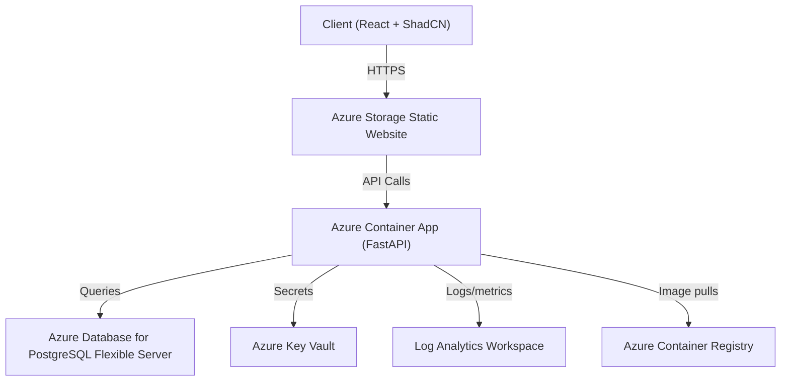

# Architecture Overview

This document summarizes how the Azure Todo Stack is assembled across frontend, backend, and infrastructure layers, and how code changes move from a developer laptop into Azure.

## High-Level Diagram

## Component Responsibilities

- **Frontend (Vite/React)** renders auth + todo screens, handles optimistic mutations via TanStack Query, and forwards a generated `x-request-id` header to the API.
- **FastAPI backend** exposes `/auth/*`, `/todos`, and `/healthz`, authenticates via JWT, and emits JSON logs through structlog with `request_id`, `user_id`, and latency metadata.
- **PostgreSQL Flexible Server** stores normalized user/todo tables managed by SQLModel + Alembic.
- **Azure Container Apps** hosts the backend container, injects environment variables from Key Vault secrets, and sends stdout/stderr to Log Analytics.
- **Azure Key Vault** holds the generated JWT secret and the Postgres connection string, granting the Container App identity `Key Vault Secrets User`.
- **Azure Storage Static Website** serves the compiled React assets; `scripts/deploy_frontend.sh` handles uploads.
- **Azure Container Registry** stores multi-arch backend images; `scripts/build_and_push_backend.sh` builds a linux/amd64 image and tags it with both the git SHA and `latest`.

## Deployment Workflow

1. **Build & Test Locally** – run `uv run pytest` and `pnpm test`, or use `./scripts/dev.sh` with Docker Compose for a full stack.
2. **Push Backend Image** – `./scripts/build_and_push_backend.sh --acr-name <acr>` logs into ACR, builds via `docker buildx --platform linux/amd64`, and pushes tags.
3. **Apply Terraform** – `terraform apply` inside `infra/terraform` provisions/updates Container Apps, Storage static site, Postgres, Key Vault, Log Analytics, and identities.
4. **Upload Frontend** – `./scripts/deploy_frontend.sh --storage-account <name>` optionally rebuilds the Vite app (pnpm) and uses `az storage blob upload-batch` to sync `frontend/dist` into the `$web` container.
5. **Smoke Test** – hit the API health probe (`/healthz`) via the Container App FQDN and load the static website endpoint to ensure it fetches todos successfully.

### CI/CD Automation

GitHub Actions handles the same lifecycle whenever changes land on `main`. After unit tests pass, the deployment job:
- builds/pushes the backend container to ACR (tagged with the commit SHA),
- runs Terraform (remote Azure Storage backend) with the new image reference,
- executes Alembic migrations against the managed PostgreSQL instance using psycopg v3, and
- compiles the Vite frontend before uploading the assets to the static website.

GitHub secrets store the Azure service-principal credentials, ACR/Storage identifiers, Terraform backend coordinates, and database admin credentials so the workflow can operate non-interactively.

## Observability & Operations

- Structlog emits JSON with timestamps, log levels, and contextual metadata, enabling Log Analytics queries such as `AppPlatformLogs_CL | where ContainerAppName_s == "api-azuretodo-dev"`.
- Request IDs originate in the frontend (or middleware) and propagate via the `X-Request-ID` header so logs can be correlated end-to-end.
- Terraform state is stored remotely in Azure Blob Storage (see `scripts/bootstrap_tf_state.sh`); `terraform plan` must be clean before merging infra changes.
- Rolling backend updates involve: build/push image ➜ update `container_image` var ➜ `terraform apply` ➜ verify health. Frontend updates require rebuilding assets and re-running `scripts/deploy_frontend.sh`.
